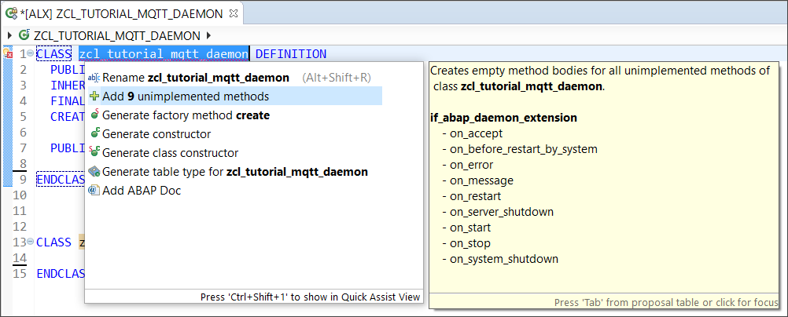

# Migrate SAP ASE Database from On-Premise to SAP HANA Cloud Test

<!-- description --> Migrate SAP ASE Database from On-Premise to SAP HANA Cloud

## Prerequisites
- You have completed the [previous tutorial](hana-cloud-ase-migration-2) on how to encrypt your SAP ASE database to migrate from on-premise to SAP HANA Cloud.

## You will learn
- How to create an SAP HANA Cloud, SAP ASE database instance slovo
- How to copy the encrypted backup to MS Azure using **`azcopy`**
- How to load the encrypted backup something

## Intro

Migrating an SAP ASE database from on-premise to the cloud requires a bit of preparation and a few important steps. You can look at each of them in more detail, but these are the high-level steps required:

1.	Pre-requisites for migration
2.	Pre-Migration - Encrypt the on-premise SAP ASE database
3.	Migration - Create the SAP HANA Cloud, SAP ASE databqase
4.	Migration - Copy the Encrypted Backup to MS Azure
5.	Migration - Load the Encrypted Backup

This tutorial will cover the steps (3 to 5) involving the migration. You can learn about the [first](hana-cloud-ase-migration-1) and the [second](hana-cloud-ase-migration-2) step by referring to the previous tutorials.

---

### Create the SAP HANA Cloud, SAP ASE database instance

<!-- border -->    

text

<!--border;size:500px-->    

text

<!--size:500px-->    

text


Now it's time to make sure your SAP ASE database in SAP HANA Cloud is ready to receive the data from your on-premise SAP ASE database. To ensure this, follow these steps:

1.	Provision an SAP HANA Cloud, SAP ASE database instance. The database in SAP HANA Cloud should be at least the same size as the on-premise one, but you might find that you need to increase the size as you go through the migration and performance test. Find more information on our technical documentation.

2.	Configure your SAP ASE database in SAP HANA Cloud. You can find details of the various operational steps to back up the database, SAP ASE configuration or list out the login accounts, roles, and database cache bindings on the SAP HANA Cloud, SAP ASE Migration Guide.

3.	Make sure the SAP HANA Cloud, SAP ASE master database is encrypted with a password and not using an external HSM.

    ```Shell/Bash
    sp_encryption helpkey, sybencrmasterkey
    ```
    If it was not encrypted with a password, then add a password for the master key.

    ```Shell/Bash
	alter encryption key master with external key
	modify encryption with passwd "<PASSWORD>"
	```
4.	Extract the database-encryption-key from the on-premise SAP ASE database.  There is a `dek_mig_gen.py` key migration script to automatically build the create encrypt key command.  Here is the syntax to use with this script in order to get the database-encryption-key:

    ```Shell/Bash
	export SYBROOT=/sap/ASE16sp04GA/sap/python_client/testcode/dek_mig_gen.py -U sa -P <PASSWORD> -S <OnPremiseASE> -K <KEY_NAME> -M <PASSWORD>
	```
    Optionally, you can manually build the database-encryption-key from the on-premise SAP ASE database using `ddlgen`. Instructions for building out the database-encryption-key using `ddlgen` can be found in the SAP HANA Cloud, SAP ASE Migration Guide.

    ```Shell/Bash
	ddlgen -Usa -P<PASSWORD> -SASE16sp04GA -Dmaster -TEK -XOD -N %
	```

5.	Create the **encrypted** database in the SAP HANA Cloud, SAP ASE. Execute the command previously created as part of the previous step (step 3) to create the database encryption key in the SAP HANA Cloud, SAP ASE.

6.	Create the database using the migrated DEK.

    > **CAUTION**
    >
    > It is very important to create the database **with the encrypted key**. If you don't, the database will still be created but you won't be able to load the database later.

    ```Shell/Bash
    create database <DATABASE_NAME> on datadev11="1G" log on logdev11="50M" for load encrypt with <KEY_NAME>
    ```


### Copy the encrypted backup to MS Azure using azcopy


You can see a migration demo video here, and then check out the detailed steps:

<iframe width="560" height="315" src="https://urldefense.com/v3/__https://www.youtube.com/embed/zNAfk9Wt0Qo__;!!GF_29dbcQIUBPA!lv2WWH1SnniEy-6iRkEYgH4p1xWzLVRHZNEAaJHWGhRvASDV51lH3hBc648fq8crMnioQw$ [youtube[.]com]" frameborder="0" allowfullscreen></iframe>

&nbsp;

1.	If you don't already have an Azure account, you can go to [this website](https://azure.microsoft.com/en-us/free/) and create one.  Once you have logged into the Azure portal, proceed to create an Azure Storage Account of type `blogstorage`.

2.	Install the `azcopy` tool using the help of [this link](https://urldefense.com/v3/__https://docs.microsoft.com/en-us/cli/azure/install-azure-cli-linux?pivots=dnf__;!!GF_29dbcQIUBPA!lv2WWH1SnniEy-6iRkEYgH4p1xWzLVRHZNEAaJHWGhRvASDV51lH3hBc648fq8dXIXBgWw$ [docs[.]microsoft[.]com]).

    Then run this command:
    ```Shell/Bash
	rpm --import https://urldefense.com/v3/__https://packages.microsoft.com/keys/microsoft.asc__;!!GF_29dbcQIUBPA!lv2WWH1SnniEy-6iRkEYgH4p1xWzLVRHZNEAaJHWGhRvASDV51lH3hBc648fq8dluBbZyQ$ [packages[.]microsoft[.]com]
	```

3.	Once you have `azcopy` loaded on your system, you will need to log in into your azure account with `azcopy`. Below is the command that you use to do this:

    ```Shell/Bash
	/docker/toolkit/microsoft/azcopy_linux_amd64_10.9.0/azcopy login --tenant-id "XXXXXXX-XXXX-XXXX-XXXX-XXXXXXXXXXXX"
	```
    Replace the `tenant-id` above with the `tenant-id` of your MS Azure account.  After you have executed the `azcopy login` command above, you will be asked to open a browser and type in a code that was provided to allow the access.

4.	Next, create a container using the `azcopy` tool.

    ```Shell/Bash
	/docker/toolkit/microsoft/azcopy_linux_amd64_10.9.0/azcopy make "https://urldefense.com/v3/__https://salsestorage01.blob.core.windows.net/__;!!GF_29dbcQIUBPA!lv2WWH1SnniEy-6iRkEYgH4p1xWzLVRHZNEAaJHWGhRvASDV51lH3hBc648fq8c9Rpd6Wg$ [salsestorage01[.]blob[.]core[.]windows[.]net]<DATABASE_NAME>container"
	```
5.	Using the MS Azure portal, generate a shared access signature (SAS) and assign to signing key 1 (access key).

6.	Finally, upload the on-premise encrypted backup to the azure storage account using `azcopy`. Be sure to select the database directory name as the root of the directory tree that you want uploaded.

    ```Shell/Bash
	/docker/toolkit/microsoft/azcopy_linux_amd64_10.9.0/azcopy copy '<DATABASE_NAME>_dumpdir/<DATABASE_NAME>' 'https://urldefense.com/v3/__https://salsestorage01.blob.core.windows.net/__;!!GF_29dbcQIUBPA!lv2WWH1SnniEy-6iRkEYgH4p1xWzLVRHZNEAaJHWGhRvASDV51lH3hBc648fq8c9Rpd6Wg$ [salsestorage01[.]blob[.]core[.]windows[.]net]<DATABASE_NAME>container?sp=racwdl&st=2021-02-28T14:19:34Z&se=2022-03-01T22:19:34Z&spr=https&sv=2020-02-10&sr=c&sig=yKCnItSYnfkIb%2BqFzTu7iiP3Saso2zPqY%2F1QtgiEpH8%3D' --recursive
	```

Replace the full https parameter in the `azcopy` command above with your shared access signature (SAS) created in step 5.


### Implement static methods

In this step, you will create two static methods `START` and `STOP`. They are used to instantiate and terminate your ABAP Daemon and will be called by another ABAP Program.

At first, define the methods by inserting the following code into the `PUBLIC SECTION` in the class definition of your ABAP Daemon class:

```ABAP
CLASS-METHODS start
  IMPORTING
    iv_daemon_name        TYPE string
    iv_subscription_topic TYPE string
    iv_publish_topic      TYPE string
  RAISING
    cx_abap_daemon_error
    cx_ac_message_type_pcp_error.

CLASS-METHODS stop
  IMPORTING
    iv_daemon_name TYPE string
  RAISING
    cx_abap_daemon_error.
```

Now, copy the static `START` method below into your class implementation. This instantiates the daemon and passes all necessary parameters via PCP.

```ABAP
METHOD start.
  " set ABAP Daemon start parameters
  DATA(lo_pcp) = cl_ac_message_type_pcp=>create( ).
  lo_pcp->set_field( i_name = 'name' i_value = iv_daemon_name ).
  lo_pcp->set_field( i_name = 'sub_topic' i_value = iv_subscription_topic ).
  lo_pcp->set_field( i_name = 'pub_topic' i_value = iv_publish_topic ).

  " start the daemon application using the ABAP Daemon Manager
  cl_abap_daemon_client_manager=>start(
      i_class_name = 'ZCL_TUTORIAL_MQTT_DAEMON'
      i_name       = CONV #( iv_daemon_name )
      i_priority   = cl_abap_daemon_client_manager=>co_session_priority_low
      i_parameter  = lo_pcp ).
ENDMETHOD.
```

The `STOP` method below can be used to terminate the daemon. It uses the *ABAP Daemon Client Manager* to retrieve a list of all running ABAP Daemon instances of your class and stops them.

Add these lines to the class implementation:

```ABAP
METHOD stop.
  " retrieve the list of ABAP Daemon instances
  DATA(lt_ad_info) = cl_abap_daemon_client_manager=>get_daemon_info( i_class_name = 'ZCL_TUTORIAL_MQTT_DAEMON').

  " for each running daemon instance of this class
  LOOP AT lt_ad_info ASSIGNING FIELD-SYMBOL(<ls_info>).

    " stop the daemon if the names match
    IF iv_daemon_name = <ls_info>-name.
      cl_abap_daemon_client_manager=>stop( i_instance_id = <ls_info>-instance_id ).
    ENDIF.

  ENDLOOP.
ENDMETHOD.
```

### Step With Options

> **For this step, select your preferred connection method by clicking on the options under the step title.**
>
> !

[OPTION BEGIN [SAP HANA Database Explorer]]

<!-- option (SAP HANA Database Explorer) -->
After confirming the status, click on the three dots again and select the option to **Open SQL Console** in the SAP HANA Database Explorer.
>You can also navigate to the same destination by selecting the option to open SAP HANA Database Explorer.

1.	Look for the name of your standalone data lake from the database menu located on the left side in the database explorer.

2.	Click on the  **icon** in the top-left corner to open a new SQL Console.

3.	You can confirm the connection to your standalone data lake from the connection status provided on the menu in the SQL Console.

<!-- option-end -->
[OPTION END]
[OPTION BEGIN [dbisql]]
>Connecting to a data lake instance with Interactive SQL is another option besides using the SAP HANA Database Explorer. If you want to connect using Interactive SQL (dbisql), you need to have it installed on your local system. You can download the Interactive SQL using the link provided in the [technical documentation](https://help.sap.com/viewer/a895964984f210158925ce02750eb580/LATEST/en-US/2fdb23a4fb364e06ace0eea0c9a4afec.html).

There are two ways to connecting to an instance through an Interactive SQL- from the graphical user interface or from the command line.

These are the steps towards connecting to your instance through the graphical user interface of Interactive SQL:

1.	Launch the SAP Interactive SQL in your system. The Connect dialog box should appear as shown below.

     !

2.	Select **Change database type** and choose **SAP HANA Cloud Data Lake**.

     !

3.	After selecting the database type, ensure that the encryption parameters placed under the security tab have been pre-filled, as shown below.

    !

4. Enter the credentials for your data lake instance under the Identification section. For example, in the **User ID** field, enter HDLADMIN and then enter your **password** that you set while creating your instance.

    !


    Next, you must enter your Instance ID and Landscape. These details can be found in the SAP HANA Cloud Central wizard of your instance in the SAP HANA Cloud.

5.	Open the **SAP HANA Cloud Central** wizard and locate your standalone data lake from the list of all instances. Select the three dots under the Actions column for your instance and choose **Copy Instance ID** to copy the Instance ID to the clipboard. Then, paste the Instance ID into the Instance ID field in the Interactive SQL.

     !

6.	Switch back to the SAP HANA Cloud Central window. Again, select Actions to choose **Copy SQL Endpoint**. Paste the SQL Endpoint in a notepad file for viewing. The SQL Endpoint is composed of the Instance ID, Landscape and Port.

7.	Paste the information on the Landscape that you isolated from the SQL Endpoint into the Interactive SQL, and click **Connect**.

    !

8.	Now, you should be connected to your data lake instance thorough Interactive SQL, as seen in the below image.

     !

[OPTION END]
[OPTION BEGIN [CLI]]

If you would like to connect to your data lake instance through an Interactive SQL from the command line, please follow the instructions given below.

1.	Connecting to a data lake instance through an Interactive SQL from the command line requires a Connection String. To extract the connection string, ensure all fields on the Identification tab are filled in. Select **Tools**, then choose **Copy Connection String to Clipboard**.

    !

2.	After pasting the connection string in a notepad file, you can the distinguish the parts as seen below.
>**The password field must be filled using the password for your data lake instance before using this string to connect from the command line.** The connecting string consists of the port number at the end of Landscape information and is followed by the encryption parameters.

    !


3.	Now, open a Command Prompt window in your system. To begin an Interactive SQL session, execute the following command given below.
```
dbisql -c <CONNECTION_STRING>
```

    **For example**, paste the connection string as shown below.
```
dbisql -c "UID=HDLADMIN;PWD=SamplePassword;host=a111111a-1a11-11aa-a11a-1a1a11a1a111.iq.hdl.test.hanacloud.ondemand.com:443;ENC=TLS(tls_type=rsa;direct=yes)"
```

    !


4.	An Interactive SQL window should show up on your screen and you are now connected to your data lake instance, as seen below.

    !

5.	You can also setup the connection without opening the graphical user interface of the Interactive SQL, for which you must simply add **'-nogui'** at the end of your connection string.

    **For example**, the command will look like this:
```
dbisql -c "UID=HDLADMIN;PWD=SamplePassword;host=a111111a-1a11-11aa-a11a-1a1a11a1a111.iq.hdl.test.hanacloud.ondemand.com:443;ENC=TLS(tls_type=rsa;direct=yes)" -nogui
```
    !

6.	Your User ID will be displayed after the execution of the above command which indicates that a connection to your data lake instance has successfully been made.

[OPTION END]
[OPTION BEGIN [isql]]

>**Attention**: The following instructions apply to you if you're using isql from the on-premise SAP IQ 16.1 version. Using any other open-source isql versions may lead to errors. Therefore, it's highly recommended to use the same version to avoid any errors.


Set up an open client connection to your database. Open a `linux` instance  and use the superuser account. For this example, your `$SYBASE` environment variable points to `/opt/sap` as your root folder.

To use isql, you need to have an **interfaces file**, which you can create in the vim editor. Follow these steps to create the interfaces file:

1.	Navigate to the root folder using command:  `/opt/sap/OCS-16_0/bin`

    !

2.	Enter the vim editor as the superuser account

    a.	`sudo vim interfaces`

    b.	`enter password`

    !

3.	Once you are in the vim editor, you need the SQL endpoint of your data lake instance. Retrieve it from the SAP HANA Cloud Central as shown earlier.

4.	Enter your respective credentials using the following format:

    ```
    <Instance_Name>

    query tcp ether <InstanceID>.<Landscape> <Port> ssl="CN=hanacloud.ondemand.com"
    ```

    **For example**, as shown below:

    ```
    DEMO_INSTANCE

    query tcp ether a111111a-1a11-11aa-a11a-1a1a11a1a111.iq.hdl.beta-us21.hanacloud.ondemand.com 443 ssl="CN=hanacloud.ondemand.com"
    ```

    >Note: there must be a tab used at the beginning of the second line, prior to query. Using spaces will not work.


    !


5.	Once you have entered your details, save the interfaces file, and exit the vim editor.

6.	Before connecting to a database, run the command `source SYBASE.sh`

7.	The successful execution of this command can be verified by running the command `which isql`

    !

8.	If the editor shows location of the isql, this indicates that now you can start an isql session.


9.	Start an isql session and connect to your database by running the following command and entering your credentials:
```
isql -U <username> -S <Instance_Name> -I<path to interfaces file>
```
10.	You will be prompted to enter your password.

    !

11.	When the editor shows `1>`, you are connected to your database and may run queries.

    For Example, Test query: `select @@ version`

    !


12. If you encounter the following error while trying to start an isql session:

    !

    Run the following command before trying again:

    ```
    unset LANG
    ```

    >**Attention**: This error was observed while using Ubuntu on a virtual Linux machine. This error will not occur when supported programs are used.


[OPTION END]

>In this tutorial, you have learned how to access your standalone data lake in SAP HANA Cloud. In the next tutorial, you will see how to load data into your standalone data lake.
